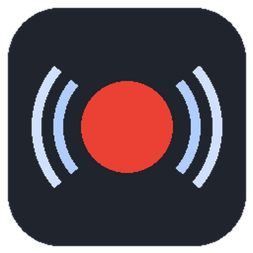
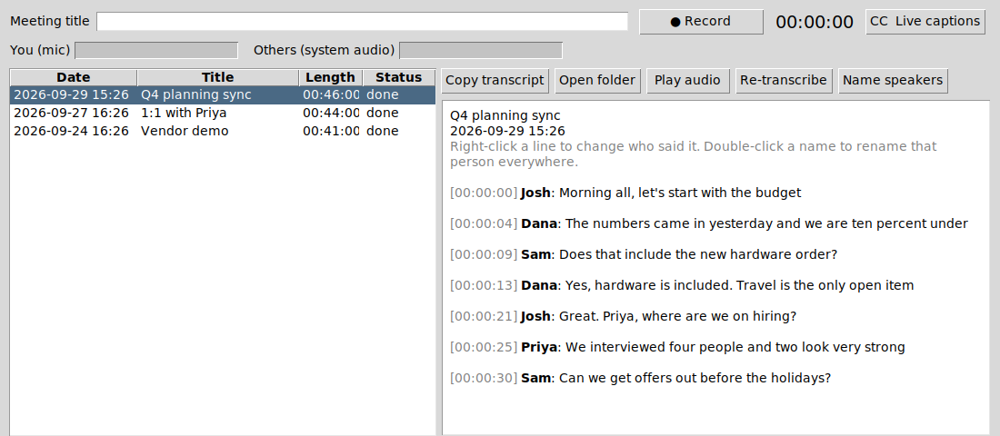
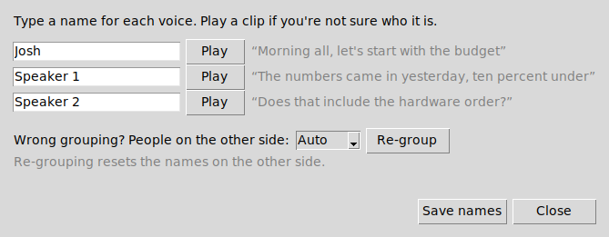
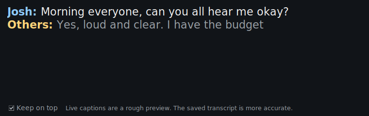
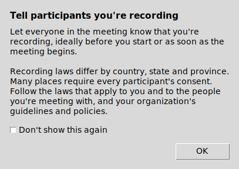

<p align="center">
  
</p>

<h1 align="center">Meeting Recorder</h1>

<p align="center">
  Records your meetings on Windows and macOS and turns them into transcripts with names.<br>
  No bot joins the call and nothing is uploaded. Audio and transcripts stay on your computer.
</p>

<p align="center">
  <a href="https://github.com/FUNGUScyberpenguin/Meetings/releases/latest"></a>
  <a href="https://github.com/FUNGUScyberpenguin/Meetings/actions/workflows/build-windows.yml"></a>
  <a href="https://github.com/FUNGUScyberpenguin/Meetings/actions/workflows/build-macos.yml"></a>
</p>

## Download

| Platform | Download | Needs |
|---|---|---|
| Windows | [**Installer (.exe)**](https://github.com/FUNGUScyberpenguin/Meetings/releases/latest/download/MeetingRecorder-Windows-Setup.exe) · [Portable (.zip)](https://github.com/FUNGUScyberpenguin/Meetings/releases/latest/download/MeetingRecorder-Windows-Portable.zip) | Windows 10 or 11, 64-bit |
| Mac with Apple silicon (M1 and later) | [**Disk image (.dmg)**](https://github.com/FUNGUScyberpenguin/Meetings/releases/latest/download/MeetingRecorder-macOS-AppleSilicon.dmg) | macOS 13 Ventura or later |
| Mac with an Intel chip | [**Disk image (.dmg)**](https://github.com/FUNGUScyberpenguin/Meetings/releases/latest/download/MeetingRecorder-macOS-Intel.dmg) | macOS 13 Ventura or later |

Not sure which Mac you have? Open the Apple menu > About This Mac. "Chip: Apple M…" means Apple silicon. "Processor: Intel" means Intel.

The first time you open the app, Windows or macOS will warn you because the app isn't code-signed yet. [Here's how to get past that](#install). Older versions are on the [releases page](https://github.com/FUNGUScyberpenguin/Meetings/releases).

<p align="center">
  
</p>

**Jump to:** [Features](#features) · [Install](#install) · [Using it](#using-it) · [Settings](#settings) · [Limits](#limits) · [For developers](#for-developers)

## Features

### Records both sides of any call

The app records two tracks at once: your microphone, and your computer's audio, which is everyone else on the call. Because it captures what your speakers or headset play, it works with Zoom, Teams, Google Meet, Webex, Slack, Discord or anything else. There's no bot to invite.

It also watches for a meeting app turning on your microphone and asks "Record this meeting?". If you say yes, it stops recording on its own about 20 seconds after the meeting app lets go of the mic.

### Transcribes on your computer

Transcription uses [faster-whisper](https://github.com/SYSTRAN/faster-whisper), a faster version of OpenAI's Whisper speech model, running locally. Nothing about your meeting is sent anywhere. The only network traffic is a one-time download of the speech models.

The app doesn't summarize. Click **Copy transcript** and paste it into whichever AI you like: ChatGPT, Claude, Copilot, Gemini or a local model.

### Knows who said what

Your lines come from your microphone. The other side of the call gets split by voice into Speaker 1, Speaker 2 and so on. Click **Name speakers** to give each voice a real name. Each voice has a sample quote and a **Play** button in case you're not sure who it is.

<p align="center">
  
</p>

If a line is credited to the wrong person, right-click it and pick the right one or type a new name. Double-click any name in the transcript to rename that person everywhere. Names are saved into every transcript file.

### Live captions

Click **CC Live captions** during a meeting for a caption window that stays on top of your other windows, with your lines in blue and the other side's in amber. Whatever someone is still saying shows in gray, then turns white once they pause.

<p align="center">
  
</p>

Captions use a small, fast model so they keep up on a laptop. The saved transcript still comes from a more accurate pass after the meeting.

### Stays out of the way

Closing the window doesn't quit the app, so it keeps watching for meetings. On Windows it lives in the system tray by the clock, and its icon turns red while recording. Right-click the tray icon to start or stop a recording, open captions, or quit. On a Mac it stays in the Dock like any other Mac app. Click the Dock icon to reopen it and press Cmd+Q to quit.

### Reminds you to ask for consent

Every time a recording starts, the app reminds you to tell everyone they're being recorded and to follow the laws and policies that apply to you. The recording is already running while the reminder is open, so nothing gets lost. Tick "Don't show this again" if you don't need it.

<p align="center">
  
</p>

### Your files, in plain formats

Each meeting gets its own folder in `Documents\Meetings` (Windows) or `~/Documents/Meetings` (Mac):

| File | What it's for |
|---|---|
| `transcript.txt` | Plain text with timestamps. Best for pasting into an AI tool. |
| `transcript.md` | Formatted for notes apps such as Obsidian or Notion. |
| `transcript.srt` | Subtitles. Open `meeting.wav` in VLC with this file to read along. |
| `transcript.json` | Every line with start and end times, for scripts. |
| `meeting.wav` | Both sides mixed together, for listening back. |
| `mic.wav`, `system.wav` | The two raw recordings. |

## Install

### Windows

1. Download the [installer](https://github.com/FUNGUScyberpenguin/Meetings/releases/latest/download/MeetingRecorder-Windows-Setup.exe) and run it.
2. If Windows says "Windows protected your PC", click **More info**, then **Run anyway**. That warning appears because the app isn't code-signed yet.
3. Leave the options ticked unless you don't want them. One starts the app with Windows, hidden in the tray, so it can catch meetings. The other adds a desktop shortcut.

It installs for your user only, so it never asks for an administrator password. Remove it from Settings > Apps like any other program.

With the [portable zip](https://github.com/FUNGUScyberpenguin/Meetings/releases/latest/download/MeetingRecorder-Windows-Portable.zip), unzip it anywhere and run `MeetingRecorder.exe`. Keep all the files in that folder together.

### macOS

1. Download the disk image for [Apple silicon](https://github.com/FUNGUScyberpenguin/Meetings/releases/latest/download/MeetingRecorder-macOS-AppleSilicon.dmg) or [Intel](https://github.com/FUNGUScyberpenguin/Meetings/releases/latest/download/MeetingRecorder-macOS-Intel.dmg), open it, and drag **Meeting Recorder** into Applications.
2. Open the app. macOS blocks it the first time because it isn't signed with an Apple Developer ID yet. Go to System Settings > Privacy & Security, scroll down, and click **Open Anyway**.
3. Start a recording. macOS asks for two permissions:
   - **Microphone**, for your side of the call.
   - **Screen & System Audio Recording**, for everyone else. macOS puts system audio under screen recording, but the app only keeps the sound. After you allow it, macOS asks you to quit and reopen the app.

If you clicked Don't Allow by mistake, the app offers to open the right page in System Settings. On macOS 15 and later, macOS asks every so often whether Meeting Recorder should keep that permission. Click **Allow** to keep recording both sides.

The app sets itself to start when you log in, hidden in the Dock, so it can catch meetings. Turn that off in Settings. Spotting meetings automatically needs macOS 14 Sonoma or later. On macOS 13 you start recordings yourself.

### The first transcription takes longer

The first time the app transcribes a meeting, it downloads the Whisper speech model (about 500 MB for the default "small" model) and the voice models used to tell people apart (about 47 MB). After that everything works offline.

## Using it

1. Type a meeting title, or leave it blank, and click **Record**. The two level bars show that sound is coming in from your mic and from the call.
2. Click **Stop** when the meeting ends. The transcript is ready a few minutes later.
3. Pick the meeting in the list. Click **Name speakers** to put names to voices, then **Copy transcript** to paste it wherever you want.

## Settings

Open **File > Settings** (or press Cmd+, on a Mac).

The Whisper model is the main tradeoff between speed and accuracy. `small` runs at a usable speed on most laptops. `medium` and `large-v3` are more accurate but slow without a graphics card. With an NVIDIA card, pick `large-v3` and leave "Run Whisper on" at `auto`. That also needs NVIDIA's cuBLAS and cuDNN libraries (see the faster-whisper README). If they're missing, the app quietly uses the processor instead.

Leave Language blank to detect it automatically, or set `en` if every meeting is in English. A fixed language is slightly faster and avoids the odd sentence coming out in the wrong language.

Keep the microphone and speakers on the system default unless a level bar stays flat while people talk. The speaker setting has to be the device you actually hear the call through, because that's where the app listens.

If the app gets the number of people wrong, open **Name speakers**, choose how many people were on the other side, and click **Re-group**. That reuses the existing transcript, so it's much faster than transcribing again. Turn off "Tell apart the other people on the call" if you'd rather have a single "Others" label.

Live captions are off by default because they keep part of the processor busy while you record. Tick "Show live captions when recording starts" to open them every time. "Live caption model" trades speed for accuracy: `tiny` is quickest, `base` is the default, and `small` is sharper but needs a fast computer.

Everything else the app does on its own is on by default and has its own checkbox. That covers the "Record this meeting?" prompt, stopping when the meeting ends, transcribing right after recording, the consent reminder, staying open when you close the window, and starting at login.

Settings are saved in `%APPDATA%\MeetingRecorder\settings.json` on Windows and `~/Library/Application Support/MeetingRecorder/settings.json` on a Mac.

## Limits

Telling voices apart is automatic, so it makes mistakes. People with similar voices can end up merged into one speaker, and one person on a bad connection can be split in two. When two people talk over each other, the line goes to whoever was louder. Re-group with the right number of people and fix single lines by right-clicking. People sharing your microphone, such as colleagues in the same room, count as you.

Wear headphones if you can. On laptop speakers your microphone hears the other side too. The app removes lines your mic picked up from the speakers, but a headset gives a cleaner transcript.

It runs on Windows 10 and 11, and macOS 13 or later. There's no Linux version.

The apps aren't code-signed yet, which is why Windows and macOS warn on first launch. On a Mac it also means macOS may ask for the recording permission again after each update. A Windows code-signing certificate and a paid Apple Developer account fix both.

Always tell people you're recording. Many US states and many countries require everyone's consent.

## For developers

<details>
<summary><b>How the builds are made</b></summary>

<br>

GitHub Actions builds the apps on real Windows and Mac machines for every push: [`build-windows.yml`](.github/workflows/build-windows.yml) makes the installer and the portable zip, and [`build-macos.yml`](.github/workflows/build-macos.yml) makes the Apple silicon and Intel disk images. Before keeping a build, each workflow runs the finished app in self-test mode. The operating system speaks a test sentence, and the packaged app has to transcribe it and find the speaker. Builds from ordinary pushes appear under each workflow run's **Artifacts**.

Pushing a version tag publishes a release, and the download links at the top of this page point to the newest one:

```powershell
git tag v0.1.0
git push origin v0.1.0
```

</details>

<details>
<summary><b>Build the Windows app yourself</b></summary>

<br>

1. Install Python 3.10, 3.11 or 3.12 from [python.org](https://www.python.org/downloads/windows/) and tick "Add python.exe to PATH".
2. Open `scripts\install.ps1` in PowerShell ISE and run it (F5). This creates a `.venv` folder and a desktop shortcut that runs the app from source.
3. Open `scripts\build_exe.ps1` in ISE and run it. The app lands in `dist\MeetingRecorder\MeetingRecorder.exe`. If [Inno Setup 6](https://jrsoftware.org/isdl.php) is installed, the script builds the installer too.

If ISE refuses to run the scripts, run this in the ISE console once, then try again:

```powershell
Set-ExecutionPolicy -Scope CurrentUser RemoteSigned
```

</details>

<details>
<summary><b>Build the Mac app yourself</b></summary>

<br>

Install the Xcode command line tools (`xcode-select --install`) and Python 3.10 to 3.12, then run `./scripts/build_macos.sh` in Terminal. It compiles the ScreenCaptureKit helper, builds `dist/Meeting Recorder.app`, self-tests it, and makes the `.dmg`.

To run from source instead, run `./scripts/build_macos.sh helper`, then `.venv/bin/python -m meeting_recorder`. From source, macOS gives the permissions to Terminal rather than to Meeting Recorder.

</details>

<details>
<summary><b>Command line</b></summary>

<br>

From a source install:

```powershell
.venv\Scripts\python -m meeting_recorder devices            # list mics and speakers
.venv\Scripts\python -m meeting_recorder record -t "1:1"    # record until Ctrl+C, then transcribe
.venv\Scripts\python -m meeting_recorder transcribe "C:\Users\you\Documents\Meetings\2026-09-24_1430_1-1"
```

</details>

<details>
<summary><b>Tests and code layout</b></summary>

<br>

```powershell
.venv\Scripts\pip install -e .[dev]
.venv\Scripts\python -m pytest
```

| Module | Job |
|---|---|
| `audio.py` | Records the mic and system audio, keeps them lined up, mixes them. |
| `transcribe.py` | Runs Whisper on each track, removes echo, merges turns, writes the export formats. |
| `diarize.py` | Tells voices apart on the call audio with sherpa-onnx, so people can be named. |
| `meetings.py` | Meeting folders, `meta.json`, processing, and renaming speakers. |
| `captions.py` | Live captions: finds speech in each track and transcribes it as you record. |
| `detect.py` | Finds which apps are using the mic. |
| `app.py` | The Tkinter window and dialogs. |
| `tray.py` | The Windows tray icon and its menu. |
| `startup.py` | Start at login: the Windows `Run` key, or a macOS LaunchAgent. |
| `macos.py` | Talks to the Swift helper: system audio, permission checks, which apps use the mic. |
| `selftest.py` | Checks that a packaged build can load its libraries, transcribe and tell voices apart. |
| `__main__.py` | Command-line entry point. |
| `packaging/` | PyInstaller spec, app launcher, Inno Setup script, and the macOS Swift helper. |

On Windows, system audio comes from WASAPI loopback (a Windows audio API). On a Mac it comes from ScreenCaptureKit, through `packaging/macos/AudioHelper.swift`, a small Swift program bundled inside the app.

</details>
